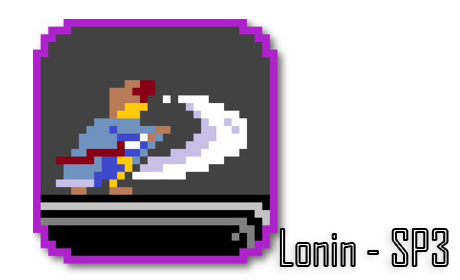

<!DOCTYPE html>
<html>
	<head>
		<title>Nivl's Github page</title>
	</head>
	<body>
		<h1>Timeline</h1>

		<h2>Nanyang Polytechnic - Diploma in Game Development and Technology (Apr 2018 - May 2021)</h2>

		<h3>NYP - GDT yr 1 sem 1 (Apr 2018 - Sep 2018)</h3>
			<pre>
				Linear Algebra
				C++ Programming
				HTML, CSS, Javascript
				Game Design
			</pre>

		<h3>NYP - GDT yr 1 sem 2 (Oct 2018 - Mar 2019)</h3>
			<pre>
				Game Physics
				Computer Graphics
				Project Management
				Data Structure
			</pre>

		<h3>NYP - GDT yr 2 sem 1 (Apr 2019 - Sep 2019)</h3>
			<pre>
				Advanced Computer graphics
				Programming Physics
				Game Development Techniques
				Advanced Data Structures and Algorithms
				Game Level Design
			</pre>

		

		<h3>NYP - GDT yr 2 sem 2 (Oct 2019 - Mar 2020)</h3>
			<pre>
				Mobile Programming
				Advanced Game Development Techniques
				Multiplayer Programming
				Artificial Intelligence in Games
			</pre>
		<h3>NYP - GDT yr 3 sem 1 (Apr 2019 - Sep 2019)</h3>
			<pre>
				Server Development
				Console Game Development
				Mixed Reality Experience Design
			</pre>
		<h3>NYP - GDT yr 3 sem 2 (Oct 2019 - Mar 2020)</h3>
			<pre>
				Internship
				Final Year Project
			</pre>

		<h1>Self-projects (5 May 2021 - Current)</h1>

		<h3>Stuff</h3>
	</body>
</html>